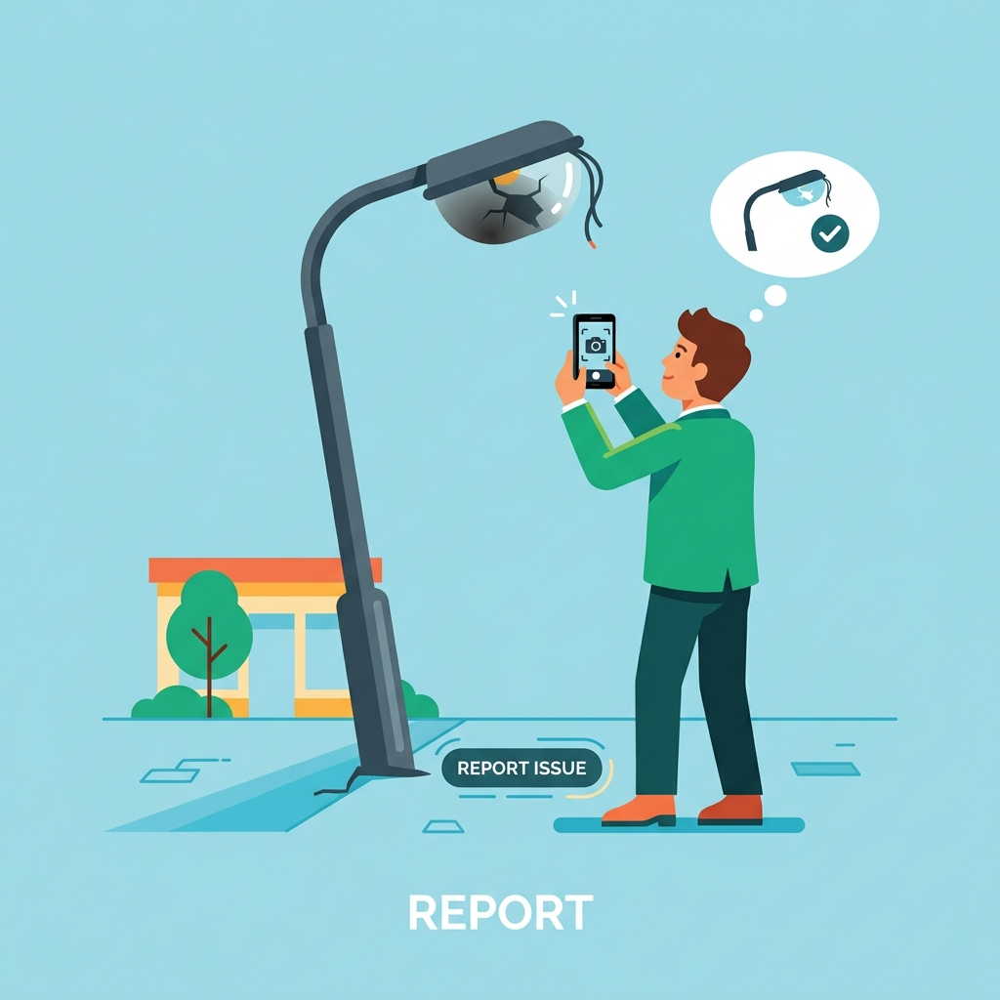
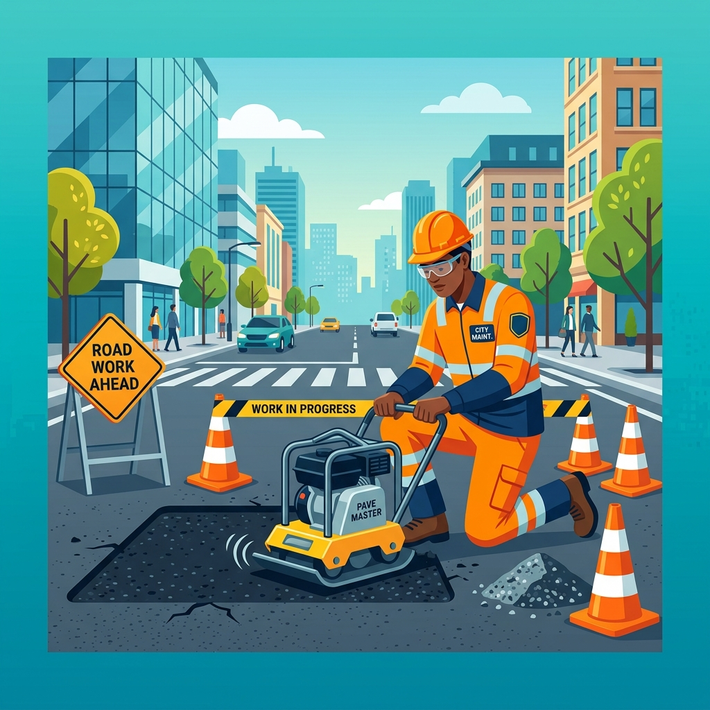
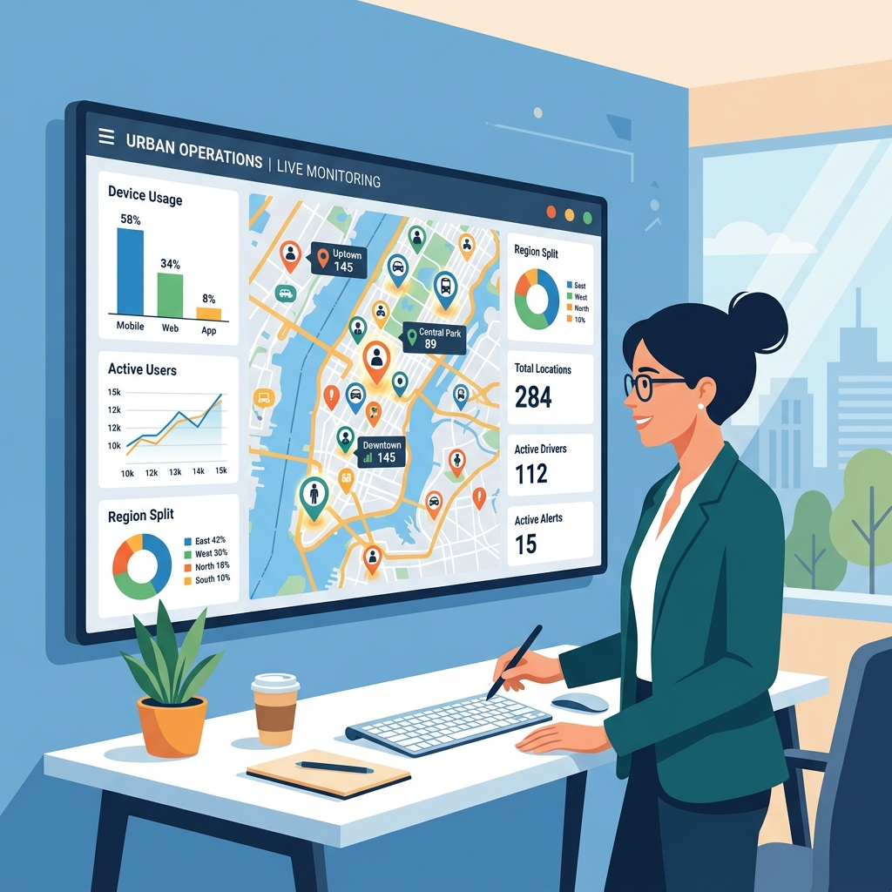

# PROJECT PLANNING, DESIGN & DOCUMENTATION - Group 31
## Requirement Analysis - JanSamadhan
*Understanding what needs to be built before deciding how to build it.*

---

### 1. Position of Requirement Analysis in the Project Lifecycle
Requirement analysis is the first major activity in the project planning and design phase. It creates the foundation for system design, database design, sprint planning, and development.

1. Business Problem
2. **Requirement Analysis** *(Current Stage)*
3. System Design
4. Database Design
5. Agile Sprint Planning

**Key principle:** Good software development starts with understanding the problem before writing the solution.

---

### 2. What is Requirement Analysis?
Requirement Analysis is the process of identifying, understanding, documenting, and validating what a customer or organization needs from a software system.

It helps the development team understand the expected functionality, users and roles, business rules, security expectations, performance needs, and conditions for accepting the finished system.

---

### 3. Why Requirement Analysis is Important
Consider a statement: "We need an application where citizens can report civic issues and the city can fix them." This is a useful starting point, but it is not detailed enough for development.

The team still needs answers to questions such as: Who can submit complaints? What information is required (e.g., location, photos)? Who assigns technicians? How is the status tracked? Can users comment or rate the resolution? How do we incentivize technicians?

Requirement analysis turns these questions into clear, documented requirements spanning data models, workflows, and user interfaces.

---

### 4. Case Study – JanSamadhan (Civic Complaint System)
**The Problem:** 
Currently, infrastructure complaints (potholes, broken street lights, garbage pileups) are reported through unorganized channels, emails, or phone calls. Complaints frequently get lost, duplicate reports are created, history is difficult to track, and civic management has zero real-time visibility into department performance. Furthermore, maintenance technicians lack motivation and clear task routing.

**The Business Goal (JanSamadhan):** 
Build a centralized, geo-aware, and gamified Civic Complaint System. The system must allow citizens to report problems with photos and precise GPS coordinates. It must automatically categorize these issues into departments and allow technicians to claim and resolve them. To drive efficiency, the system incorporates a Gamified Scoreboard where technicians earn points and badges for their work. Citizens can then track, comment, and rate the resolution, ensuring end-to-end transparency.

<p align="center">
  <br/>
  <i>Illustration: A citizen reporting a civic issue via mobile.</i>
</p>

#### End-to-End Ticket Resolution Flowchart
```text
                     ┌──────────────────┐
                     │   Citizen Logs   │
                     │   Into Portal    │
                     └────────┬─────────┘
                              │
                              ▼
                     ┌──────────────────┐
                     │ Create Ticket &  │
                     │ Fill Form Details│
                     └────────┬─────────┘
                              │
                              ▼
                     ┌──────────────────┐
                     │ System Assigns   │
                     │ Unique Ticket ID │
                     │  Status = OPEN   │
                     └────────┬─────────┘
                              │
                              ▼
                     ┌──────────────────┐
                     │ Help Desk Agent  │
                     │  Reviews Queue   │
                     └────────┬─────────┘
                              │
                              ▼
                     ┌──────────────────┐
                     │ Assign Priority &│
                     │ Department Unit  │
                     │Status=IN PROGRESS│
                     └────────┬─────────┘
                              │
                              ▼
                    ┌───────────────────┐
                    │ Issue Resolved?   │
                    └─────────┬─────────┘
                              │
                     ┌────────┴────────┐
                     │                 │
                  YES│               NO│
                     ▼                 ▼
          ┌───────────────────┐ ┌───────────────────┐
          │ Update Status to  │ │ Reassign Ticket / │
          │     RESOLVED      │ │ Escalate Priority │
          └─────────┬─────────┘ └─────────┬─────────┘
                    │                     │
                    │                     └────┐
                    ▼                          │
          ┌───────────────────┐                │
          │ Citizen Notified  │ ◄──────────────┘
          │  of Resolution    │
          └───────────────────┘
```

---

### 5. Stakeholders
A stakeholder is a person, group, or organization that is interested in the system or affected by it.

| Stakeholder | Interest / Need |
|-------------|-----------------|
| **Citizens (Users)** | Want safe neighborhoods, a transparent reporting mechanism, and accountability from civic officials. |
| **Technicians** | Need clear task lists filtered by their department/proximity, an easy way to upload "after" photos to prove work completion, and recognition for their hard work. |
| **Administrators / Civic Management** | Require macro-level visibility, interactive maps showing complaint heat-maps, performance scoreboards for departments, and the ability to manage personnel. |

---

### 6. Actors
An actor is a user or external system that directly interacts with the application.

Primary actors for JanSamadhan:
1. **Citizen (User):** Authenticated public users who report and track issues.
2. **Technician:** Authenticated civic workers assigned to specific departments (e.g., Public Works, Electrical).
3. **Administrator:** Super-users who oversee the entire platform, manage master data, and analyze map-based metrics.

<p align="center">
  <br/>
  <i>Illustration: A technician working on resolving an assigned civic issue.</i>
</p>

#### Actor-System Interaction Model
```text
                         ┌──────────────────────────────────────────────┐
                         │             JanSamadhan Platform             │
                         │                                              │
     ┌──────────────┐    │   ┌──────────────────────────────────────┐   │
     │   Citizen    ├────┼──►│ • Create & View Tickets              │   │
     └──────────────┘    │   │ • Track Ticket Status                │   │
                         │   └──────────────────────────────────────┘   │
                         │                                              │
     ┌──────────────┐    │   ┌──────────────────────────────────────┐   │
     │  Help Desk   ├────┼──►│ • View & Assign Tickets              │   │
     │    Agent     │    │   │ • Update Status & Priority           │   │
     └──────────────┘    │   └──────────────────────────────────────┘   │
                         │                                              │
                         │   ┌──────────────────────────────────────┐   │
     ┌──────────────┐    │   │ • Manage Users & Categories          │   │
     │  Admin /     ├────┼──►│ • View System Activity & Reports     │   │
     │  Management  │    │   └──────────────────────────────────────┘   │
     └──────────────┘    └──────────────────────────────────────────────┘
```

---

### 7. System Architecture
JanSamadhan is structured as a multi-tier Model-View-Controller (MVC) architecture ensuring modular separation of concerns, secure data access, and high performance across civic departments.

```text
┌────────────────────────────────────────────────────────────────────────┐
│                        PRESENTATION LAYER                              │
│  ┌──────────────────────┐ ┌──────────────────────┐ ┌────────────────┐  │
│  │   Razor Views (.cshtml)│ │  Bootstrap & CSS3    │ │ Leaflet.js Map │  │
│  └──────────┬───────────┘ └──────────┬───────────┘ └───────┬────────┘  │
└─────────────┼────────────────────────┼─────────────────────┼───────────┘
              │                        │                     │
              ▼                        ▼                     ▼
┌────────────────────────────────────────────────────────────────────────┐
│                      APPLICATION LOGIC LAYER (.NET 8.0)                │
│  ┌──────────────────────────────────────────────────────────────────┐  │
│  │ MVC Controllers (Account, Complaint, Technician, Admin)          │  │
│  └──────────────────────────────────┬───────────────────────────────┘  │
│  ┌──────────────────────────────────┴───────────────────────────────┐  │
│  │ Auth Middleware (Cookie Auth, RBAC) | Password Hash Service      │  │
│  └──────────────────────────────────┬───────────────────────────────┘  │
│  ┌──────────────────────────────────┴───────────────────────────────┐  │
│  │ Business Services (Gamification Logic, Badge Calculation)         │  │
│  └──────────────────────────────────┬───────────────────────────────┘  │
└─────────────┼───────────────────────┼──────────────────────────────────┘
              │                       │
              ▼                       ▼
┌────────────────────────────────────────────────────────────────────────┐
│                      DATA ACCESS LAYER (EF Core 8.0)                   │
│  ┌──────────────────────────────────────────────────────────────────┐  │
│  │ ApplicationDbContext (Users, Complaints, Comments, Assignments) │  │
│  └──────────────────────────────────┬───────────────────────────────┘  │
└─────────────┼───────────────────────┼──────────────────────────────────┘
              │                       │
              ▼                       ▼
┌────────────────────────────────────────────────────────────────────────┐
│                     DATABASE LAYER (MS SQL Server)                     │
│  ┌──────────────────────────────────────────────────────────────────┐  │
│  │ JanSamadhanDb (Tables, Foreign Keys, Indexes & Cascade Rules)    │  │
│  └──────────────────────────────────────────────────────────────────┘  │
└────────────────────────────────────────────────────────────────────────┘
```

#### Architectural Layers Overview:
1. **Presentation Layer (Client & Web Interface):** Built with ASP.NET Core Razor Views (`.cshtml`), Bootstrap 5, and JavaScript. Includes interactive geospatial mapping via Leaflet.js / OpenStreetMap to display complaint markers and heatmaps.
2. **Application / Business Logic Layer:** Powered by C# and .NET 8 MVC Controllers (`AccountController`, `ComplaintController`, `TechnicianController`, `AdminController`). Enforces Role-Based Access Control (RBAC), manages state transitions for complaints, handles photo uploads, and calculates gamified points/badges for technicians.
3. **Data Access Layer:** Utilizes Entity Framework Core 8.0 (`ApplicationDbContext`) as an Object-Relational Mapper (ORM) to handle database queries, transactional integrity, and entity relationships.
4. **Database Layer:** Microsoft SQL Server / LocalDB (`JanSamadhanDb`) storing structured schemas for Users, Admins, Departments, Complaints, Assignments, Comments, and Ratings.

---

### 8. Technology Stack

| Layer / Component | Technology / Library | Version / Details | Purpose |
|-------------------|----------------------|-------------------|---------|
| **Core Framework** | ASP.NET Core MVC | .NET 8.0 (`net8.0`) | High-performance, cross-platform web application backend |
| **Programming Language** | C# | C# 12 | Primary application logic language |
| **Frontend UI & Styling** | Razor Views + Bootstrap 5 | HTML5, CSS3, JS | Responsive, mobile-friendly interface for citizens & field technicians |
| **Mapping & GIS** | Leaflet.js / OpenStreetMap | JS Mapping Library | Geo-location capturing, nearby complaint discovery & heatmap analytics |
| **Database Engine** | MS SQL Server / LocalDB | SQL Server 2022 / LocalDB | Relational storage for platform entity models and activity logs |
| **ORM / Data Access** | Entity Framework Core | EF Core 8.0.6 | Database abstraction, LINQ queries, schema migrations |
| **Authentication** | Cookie Authentication | `CookieAuthenticationDefaults` | Secure stateful user sessions across Citizens, Technicians & Admins |
| **Security & Hashing** | PBKDF2 Key Derivation | `Microsoft.AspNetCore.Cryptography.KeyDerivation` | Cryptographically secure salt & hashing for passwords |
| **Authorization** | ASP.NET Core Policies | Role-Based Access Control (RBAC) | Restricts sensitive routes and administrative operations |
| **Development Tooling** | Visual Studio 2022 / VS Code | .NET 8 SDK | Development environment, EF Core CLI tooling |

---

### 9. Functional Requirements (Detailed)
A functional requirement describes what the system should do.

**A. Authentication & Authorization**
* The system shall support secure registration and login.
* The system shall enforce Role-Based Access Control (RBAC) differentiating Citizens, Technicians, and Admins.

**B. Complaint Management (Citizens)**
* Citizens shall be able to create a new complaint specifying Title, Description, Department, Photo Upload, and geo-location (Latitude/Longitude).
* Citizens shall be able to view a list of their submitted complaints and check their real-time status (Pending, In Progress, Fixed).
* Citizens shall be able to view "Nearby" complaints on a map to avoid duplicate reporting.

**C. Technician Workflow & Gamification**
* Technicians shall view an "Available Work" dashboard filtered by their assigned department.
* Technicians shall be able to update a complaint's status to "In Progress" and eventually "Fixed."
* Upon marking an issue as "Fixed," technicians must upload resolution photos.
* **Gamification:** The system shall award points to technicians for every resolved complaint, automatically upgrading their Badge (e.g., Bronze, Silver, Gold).
* The system shall display a global "Scoreboard" ranking technicians by their earned points.

**D. Administration & Analytics**
* Admins shall be able to create and manage Technician accounts and Departments.
* Admins shall have access to an interactive `AdminMap` plotting all active and resolved complaints with color-coded map markers.

**E. Communication & Feedback**
* Users and Technicians shall be able to add conversational Comments to a complaint thread.
* Once fixed, Citizens shall be able to submit a Rating (1-5 stars) and feedback on the resolution.

**F. Ticket State Machine (Lifecycle Transitions)**
The system enforces strict operational states across a ticket's lifetime, transitioning based on user and technician interactions:

```text
[ New Submission ] ──────► ┌────────────────┐
                           │      OPEN      │
                           └───────┬────────┘
                                   │
                                   │ (Agent Assigns Task)
                                   ▼
                           ┌────────────────┐
                           │  IN PROGRESS   │
                           └───────┬────────┘
                                   │
         ┌─────────────────────────┴────────────────────────┐
         │                                                  │
         │ (Work Verified)                                  │ (Invalid/Duplicate)
         ▼                                                  ▼
┌────────────────┐                                 ┌────────────────┐
│    RESOLVED    │                                 │    CLOSED      │
└────────────────┘                                 └────────────────┘
```

---

### 10. Non-Functional Requirements
A non-functional requirement describes how the system should behave or the constraints under which it should operate.

* **Performance:** The interactive map plotting hundreds of complaint markers must load within 2 seconds. Image uploads must be compressed to save bandwidth.
* **Security:** All user passwords must be securely hashed. API endpoints must validate user roles to prevent privilege escalation (e.g., a citizen cannot delete a user).
* **Usability / Mobility:** The frontend (built with Razor Pages & Bootstrap) must be fully responsive, ensuring citizens and technicians can easily operate the system via mobile devices in the field.
* **Availability:** The system must maintain 99.9% uptime, as civic emergencies can occur at any hour.
* **Data Integrity:** The database must enforce strict relational constraints (e.g., deleting a department should safely cascade or restrict orphaned complaints).

---

### 11. Functional vs Non-Functional Requirements

| Functional – What? | Non-Functional – How well / under what constraints? |
|--------------------|-------------------------------------------------------|
| Extract GPS coordinates for a complaint | The location capture must have an accuracy of 10 meters |
| Change complaint status to "Fixed" | The status update transaction must complete in under 500ms |
| Award points to technicians | The point calculation logic must be tamper-proof (Security) |
| Display Admin Map of all issues | Map rendering must be heavily cached for fast loading (Performance) |
| Allow image uploads | File storage must be highly scalable to handle thousands of photos (Scalability) |

---

### 12. Quick Classification Examples
* "The citizen should be able to upload a photo of the pothole." → **Functional**
* "The application must support mobile web browsers smoothly." → **Non-functional (Usability)**
* "The administrator should be able to deactivate a technician account." → **Functional**
* "Only authorized administrators should be able to manage departments." → **Non-functional (Security constraint)**

---

### 13. User Stories
In Agile development, requirements are often represented as user stories. 
Format: `As a [user], I want [functionality], so that [benefit].`

**Key User Stories for JanSamadhan:**
* **Citizen (Reporting):** As a citizen, I want to drop a pin on a map and upload a photo so that I can accurately report a broken street light's location.
* **Citizen (Feedback):** As a citizen, I want to rate the technician's work once my complaint is marked 'Fixed', so that I can provide quality feedback to the municipality.
* **Technician (Gamification):** As a technician, I want to earn points and climb the global scoreboard so that my hard work is publicly recognized and rewarded.
* **Administrator (Analytics):** As an administrator, I want to view a color-coded map of all active complaints so that I can identify problem hotspots in the city.

<p align="center">
  <br/>
  <i>Illustration: An administrator monitoring civic complaints and metrics via a map dashboard.</i>
</p>

---

### 14. Acceptance Criteria
Acceptance criteria define the conditions that must be satisfied for a user story to be considered complete.

**Example User Story:** As a technician, I want to resolve a complaint and earn points.

| # | Acceptance Criterion |
|---|----------------------|
| 1 | The technician must be logged in and assigned to the relevant department. |
| 2 | The technician must upload at least one "Resolution Photo" proving the work is done. |
| 3 | The system must update the complaint status from "In Progress" to "Fixed". |
| 4 | The system must automatically add the defined point value to the technician's profile. |
| 5 | If the new point total crosses a badge threshold, the technician's badge tier (e.g., Bronze -> Silver) must automatically upgrade. |

---

### 15. Given – When – Then
Acceptance criteria translated into Given–When–Then structure for the Gamification feature:

* **Given** the technician is viewing a complaint currently marked as "In Progress"
* **When** the technician uploads a completion photo and clicks "Mark as Fixed"
* **Then** the complaint status updates to "Fixed"
* **And** the technician's total points increase
* **And** the citizen receives a notification/ability to rate the service.

---

### 16. From Requirement to Development
Requirement analysis creates the foundation for the work that follows. A requirement must be traceable through design, database schema, and development tasks.

#### Requirement Traceability Pipeline
```text
┌─────────────────────────────────────────────────────────────────┐
│                      Business Requirement                       │
│              (Citizen can report a civic issue)                 │
└────────────────────────────────┬────────────────────────────────┘
                                 │
                                 ▼
┌─────────────────────────────────────────────────────────────────┐
│                           User Story                            │
│    (As a citizen, I want to create a ticket to report an issue) │
└────────────────────────────────┬────────────────────────────────┘
                                 │
                                 ▼
┌─────────────────────────────────────────────────────────────────┐
│                      Acceptance Criteria                        │
│   (Title & description required, unique ID generated, OPEN)     │
└────────────────────────────────┬────────────────────────────────┘
                                 │
                                 ▼
┌─────────────────────────────────────────────────────────────────┐
│                          System Design                          │
│          (Ticket UI View, Controller API, Auth Middleware)      │
└────────────────────────────────┬────────────────────────────────┘
                                 │
                                 ▼
┌─────────────────────────────────────────────────────────────────┐
│                         Database Design                         │
│            (Ticket, User, Category tables & foreign keys)       │
└────────────────────────────────┬────────────────────────────────┘
                                 │
                                 ▼
┌─────────────────────────────────────────────────────────────────┐
│                   Development & Sprint Task                     │
│               (Implement Ticket Creation API endpoint)          │
└─────────────────────────────────────────────────────────────────┘
```

| Stage | Example |
|-------|---------|
| Business Requirement | Gamify technician workflows to improve issue resolution rates. |
| User Story | As a technician, I want to earn points for fixing issues. |
| Acceptance Criteria | Status must update to Fixed; photos required; points added to profile. |
| System Design | Technician Dashboard UI, Scoreboard UI, Point calculation service. |
| Database Design | Add `Points` and `BadgeLevel` columns to `User` table; create `TechnicianPhotos` table. |
| Development Task | Implement `MarkAsFixed()` action in `TechnicianController` and update views. |
| Sprint | Schedule gamification features in Sprint 2. |

---

### 17. Requirement Analysis Checklist
* **Business** — Are we solving the core issue of untracked, unorganized civic complaints?
* **Users** — Have we accommodated Citizens, Technicians, and Admins appropriately?
* **Functional** — Is the workflow from Complaint Creation -> Assignment -> Resolution -> Feedback fully mapped out?
* **Non-functional** — Are security boundaries (RBAC) and map performance metrics defined?
* **Validation** — Are the Gamification and Reporting requirements testable through clear acceptance criteria?
